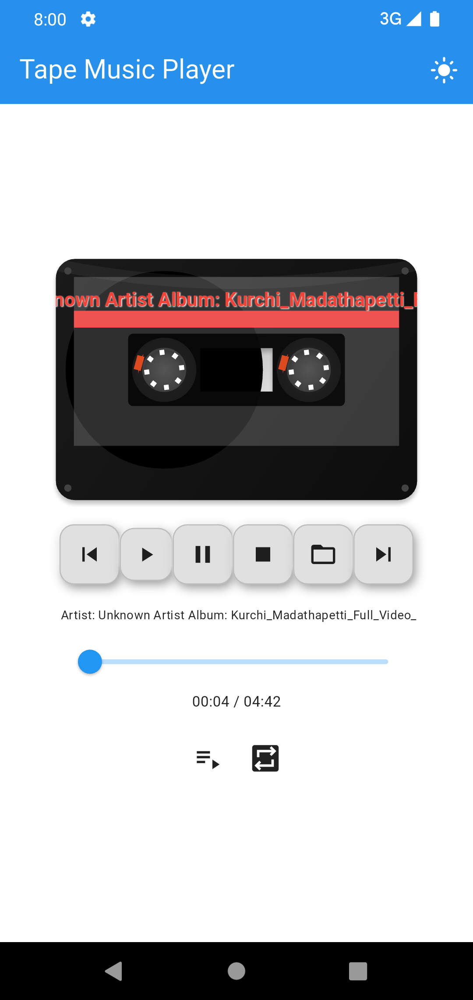

# 🎵 Tape Player

A **nostalgic cassette-style music player** built with Flutter.  
Experience your favorite tracks with retro visuals, spinning reels, scrolling labels, and customizable cassette skins.

📲 **[Download on Google Play](https://play.google.com/store/apps/details?id=com.safvanp.tape_player&pcampaignid=web_share)**

 <!-- Replace with actual path if different -->

---

## ✨ Features

- 🎞️ Retro cassette tape UI  
- 🔁 Animated reels and scrolling labels  
- 🎨 Multiple cassette skins  
- 🌗 Light & dark theme support  
- 🎵 Lyrics display support *(coming soon)*  
- ↔️ Landscape layout with tape Side A/B toggle

---

## 🚀 Getting Started (for Developers)

To build and run this Flutter app locally:

1. **Install Flutter**  
   Follow the [Flutter Installation Guide](https://docs.flutter.dev/get-started/install)

2. **Clone the Repository**

   ```bash
   git clone https://github.com/safvanp/tape_player.git
   cd tape_player
